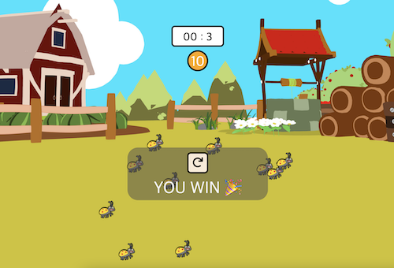
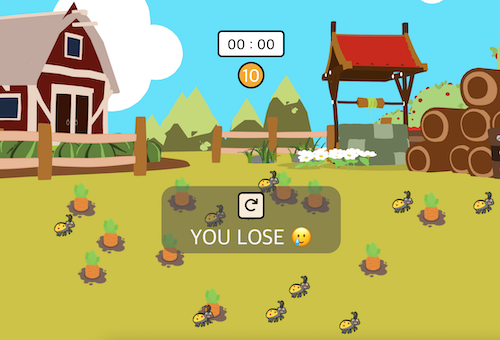

# Carrot Game 🥕

This is a toy project using HTML, CSS and JavaScript.

## Table of contents

-   [Overview](#overview)
    -   [Function](#function)
    -   [Screenshot](#screenshot)
    -   [Links](#links)
-   [My process](#my-process)
    -   [Built with](#built-with)
    -   [What I learned](#what-i-learned)
-   [Author](#author)

## Overview

### Function

Users should be able to:

-   Pull all carrots within 10 seconds
-   Avoid pulling bugs

### Screenshot





### Links

-   Live Site URL: [https://yjkim0109.github.io/carrotgame/](https://yjkim0109.github.io/carrotgame/)

## My process

### Built with

-   Semantic HTML5 markup
-   CSS
-   JavaScript

### What I learned

```css

```

## Author

-   Website - [Yeji Kim](https://github.com/yjkim0109)
